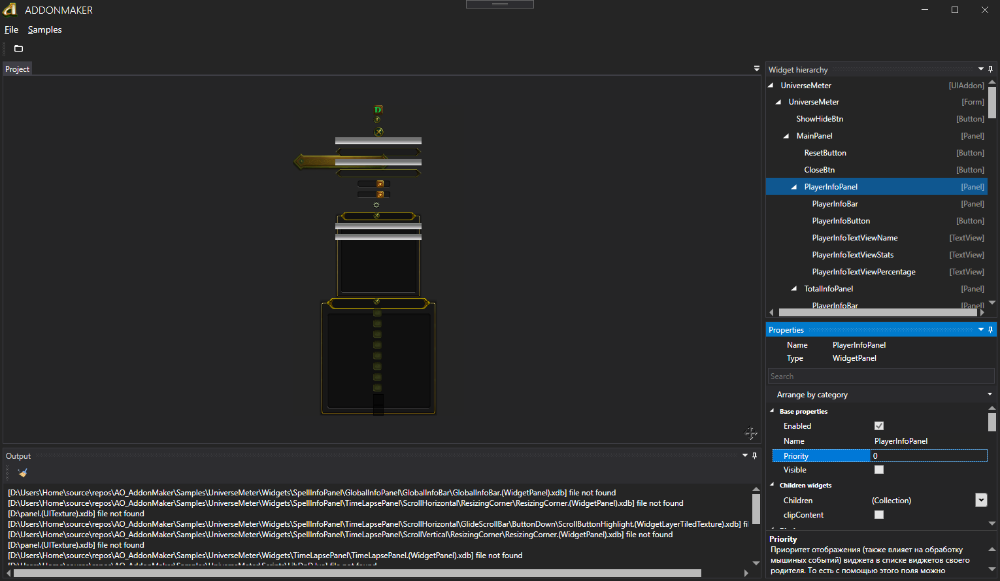

# AO_AddonMaker
This application is designed to facilitate the creation and management of custom addons for the game "Allods Online"
## Features
* View widgets
* View textures
* Checking for errors in the markup of XML files
* Checking file path errors
### TODO
* Change widget properties
* Compiling scripts with `LuaJIT`
* Packaging addons in `.pack` format

## Used Packages
* [Extended WPF Toolkit](https://github.com/xceedsoftware/wpftoolkit) [[NuGet](https://www.nuget.org/packages/DotNetZip/1.13.8)]
* [MahApps.Metro](https://github.com/MahApps/MahApps.Metro) [[NuGet](https://www.nuget.org/packages/MahApps.Metro/2.0.1)]
* [AvalonDock](https://github.com/Dirkster99/AvalonDock) [[NuGet](https://www.nuget.org/packages/Dirkster.AvalonDock/4.20.0)]
## Preview

