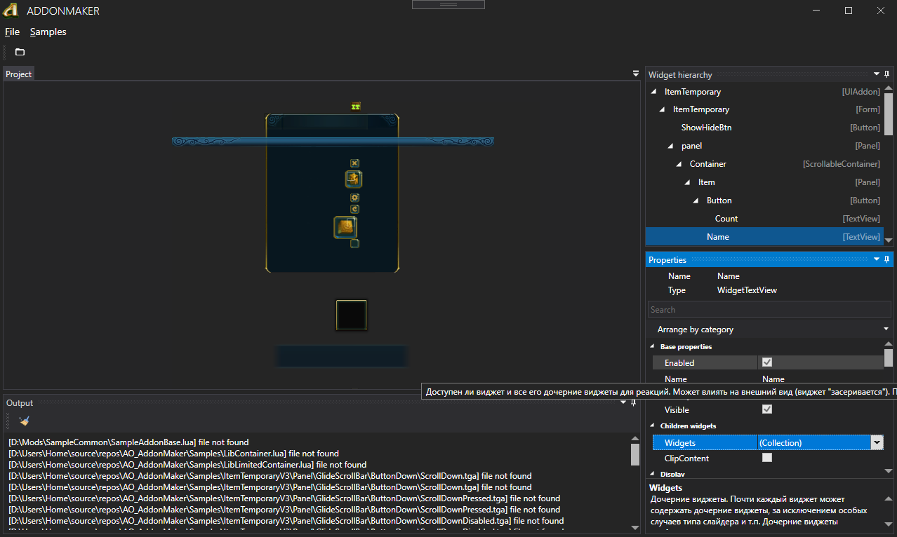

# AO Addon Maker
This application is designed to facilitate the creation and management of custom addons for the game "Allods Online"
## Features
* View widgets
* View textures
* Checking for errors in the markup of XML files
* Checking file path errors
### TODO
* Change widget properties
* Compiling scripts with `LuaJIT`
* Packaging addons in `.pack` format

## Used Packages
* [[NuGet](https://www.nuget.org/packages/Autofac)] [Autofac](https://github.com/autofac/Autofac)
* [[NuGet](https://www.nuget.org/packages/Dirkster.AvalonDock)] [AvalonDock](https://github.com/Dirkster99/AvalonDock)
* [[NuGet](https://www.nuget.org/packages/Extended.Wpf.Toolkit)] [Extended WPF Toolkit](https://github.com/xceedsoftware/wpftoolkit)
* [[NuGet](https://www.nuget.org/packages/MahApps.Metro)] [MahApps.Metro](https://github.com/MahApps/MahApps.Metro)
* [[NuGet](https://www.nuget.org/packages/NLog)] [NLog](https://github.com/NLog/NLog)
## Preview

